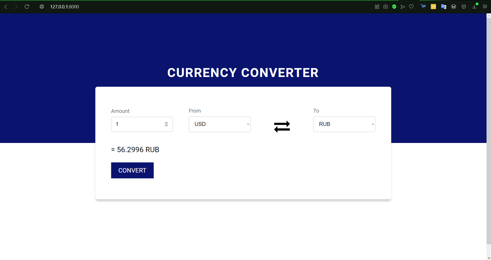

# Currency Converter 

## Kopanev Artem, VSU, Information Security, course 2

## Desciption
1. Конвертер валют, написанный на фреймворке ```Flask```. В разработке так же были использованы следующие библиотеки:
```
import requests - библиотека requests, благодаря которой нет необходимости вручную добавлять строки запроса в URL-адреса или заносить данные в форму для POST-запроса
import xml.etree.ElementTree as ET - API для управления XML, с помощью которой производится парсинг актуального курса валют с сайта Центробанка
```
2. Этот конвертер обрабатывает только такие валюты, как:
```
RUB
USD
EUR
```

## Environment

http://127.0.0.1:8000 - после запуска приложения, необходимо перейти по адресу


## Application

